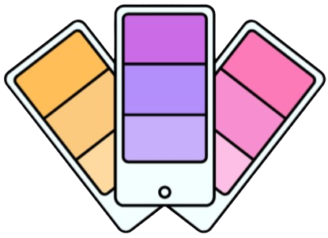

<div align="center">
  <a href="https://github.com/Ashwin-Pulipati/Pastella">
    
  </a>

  <h3 align="center">Pastella</h3>

  <p align="center">
    A feature-rich color palette generator for creating beautiful, harmonious pastel color schemes with the help of AI.
    <br />
    <a href="https://pastella.vercel.app/"><strong>View Demo »</strong></a>
  </p>
</div>

## About The Project

Pastella is a modern, web-based tool designed for designers, developers, and artists to create, explore, and generate stunning color palettes. It specializes in pastel colors and offers various generation methods, including AI-powered suggestions, gradient palettes, and solid color schemes. With a sleek, intuitive interface, Pastella makes it easy to find the perfect colors for your next project.


https://github.com/user-attachments/assets/103f9f27-e846-4dee-ab06-1187a631d03e


## ⚙️ Built With

This project is built with a modern tech stack that ensures a fast, responsive, and delightful user experience.

*   **Framework:** [Next.js](https://nextjs.org/)
*   **Styling:** [Tailwind CSS](https://tailwindcss.com/)
*   **UI Components:** Custom components with [Framer Motion](https://www.framer.com/motion/) for animations.
*   **AI Integration:** [Google Gemini API](https://ai.google.dev/)
*   **Deployment:** [Vercel](https://vercel.com/)

## ✅ Key Features

- **AI Palette Generation:** Describe your desired theme or mood, and let the AI generate a unique pastel palette for you.
- **Gradient Palettes:** Create and customize beautiful gradient color schemes.
- **Solid Palettes:** Explore and generate palettes with solid, harmonious colors.
- **Pastel Color Picker:** A specialized color picker for finding the perfect pastel shades.
- **Catppuccin Theme:** Includes the popular Catppuccin color palettes.
- **Responsive Design:** A beautiful, intuitive interface that works on all devices.

## ▶️ Getting Started

To get a local copy up and running, follow these simple steps.

### Prerequisites

Make sure you have Node.js and npm installed on your machine.
* npm
  ```sh
  npm install npm@latest -g
  ```

### Installation

1.  **Clone the repository:**
    ```sh
    git clone https://github.com/Ashwin-Pulipati/Pastella.git
    cd Pastella
    ```
2.  **Install NPM packages:**
    ```sh
    npm install
    ```
3.  **Set up your environment variables:**
    Create a `.env.local` file in the root of your project and add your Google Gemini API key.
    ```env
    # Google Gemini API Key
    GEMINI_API_KEY=
    ```
4.  **Run the development server:**
    ```sh
    npm run dev
    ```
5.  Open [http://localhost:3000](http://localhost:3000) in your browser to see the result.

## Usage

Pastella is designed to be intuitive. A user can visit the site, explore the different palette generation options, and create a palette that fits their needs. They can then copy the color codes to use in their own projects.

## Contributing

Contributions are what make the open source community such an amazing place to learn, inspire, and create. Any contributions you make are **greatly appreciated**.

If you have a suggestion that would make this better, please fork the repo and create a pull request. You can also simply open an issue with the tag "enhancement".
Don't forget to give the project a star! Thanks again!

1.  Fork the Project
2.  Create your Feature Branch (`git checkout -b feature/AmazingFeature`)
3.  Commit your Changes (`git commit -m 'Add some AmazingFeature'`)
4.  Push to the Branch (`git push origin feature/AmazingFeature`)
5.  Open a Pull Request

You can also report a bug or request a feature by opening an issue:
- [Report Bug](https://github.com/Ashwin-Pulipati/Pastella/issues)
- [Request Feature](https://github.com/Ashwin-Pulipati/Pastella/issues)


## License

Distributed under the MIT License. See `LICENSE.txt` for more information.

## Contact

Ashwin Pulipati - [LinkedIn](https://www.linkedin.com/in/ashwinpulipati/) - ashwinpulipati@gmail.com

Project Link: [https://github.com/Ashwin-Pulipati/Pastella](https://github.com/Ashwin-Pulipati/Pastella)


## Acknowledgements

[Catppuccin](https://github.com/catppuccin/catppuccin) - A community-driven pastel theme that inspires and informs the color options available in Pastella. Released under the MIT License.
